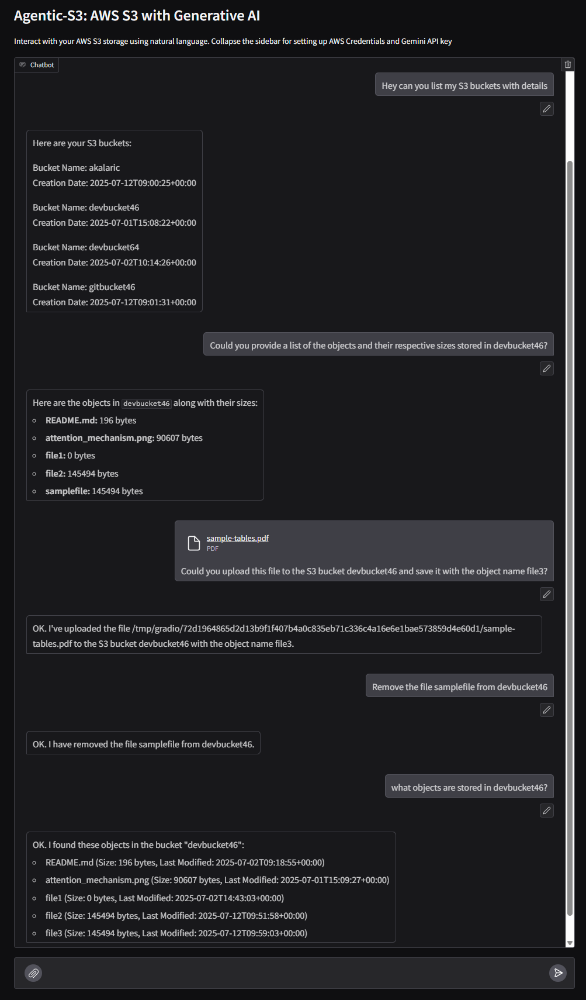

# Agentic-S3
**AI-Powered S3 Management**


**Agentic-S3** is an intelligent assistant built with the LangChain agentic framework, designed to simplify AWS S3 management through natural language. It enables seamless interaction with your S3 buckets and objects, making cloud storage operations faster, smarter, and more intuitive.

## Features

- **Conversational S3 Management**: Manage buckets and objects using plain English commands.
- **Powered by Gemini AI**: Understands and processes your queries intelligently.
- **Gradio Web Interface**: Intuitive UI for seamless, user-friendly interaction.

---

### What can I do?

I can help you manage your AWS S3 storage. Here's what I can do:

- 🪣 **List Buckets** — View all your AWS S3 buckets  
- 📁 **Show Objects** — Display objects inside a specific bucket  
- ⬆️ **Upload Files** — Send files to any bucket  
- ⬇️ **Download Files** — Retrieve files from a bucket and store them in the source dictionary
- 🔍 **Search Objects** — Find files by name or metadata  
- 🧠 **Explain Contents** — Get insights into file contents or types  
- 🏷️ **Retrieve Metadata** — Access metadata of stored objects  
- ❌ **Delete Files** — Remove unwanted files from buckets  

## Installation

1. Clone the repository:
   ```bash
   git clone https://github.com/akalaric/agentic-S3.git
   ```

2. Navigate to the project directory:
   ```bash
   cd agentic-S3
   ```

3. Install the required dependencies:
Ensure [`uv`](https://github.com/astral-sh/uv) is installed.

   ```bash
   uv sync
   ```

## Configuration

### Setting up AWS Credentials and Gemini API key
1. Obtain AWS access key ID, secret access key, and region from the AWS Management Console and configure your credentials using the .env_example file as a template
2. Ensure these credentials have appropriate permission READ/WRITE  permissions for S3.
3. Set up environment variables using the `.env_example` file:
   - Copy `.env_example` to `.env`:
     ```bash
     cp .env_example .env
     ```
   - Edit `.env` to include your AWS credentials and Gemini API key.
4. **Alternatively, this can be configured in the UI by collapsing the sidebar.**

## Usage

1. Launch the Gradio app:
   ```bash
   python main.py --ui
   ```
2. Open the web interface in your browser and start interacting with your S3 storage using natural language.

#### UI
- Intuitive interface built with Gradio.
- Collapse the sidebar for setting up AWS Credentials and Gemini API key
  


#### Run as CLI Tool
- To run the tool directly from the command line:
```bash
python main.py
```
#### Docker

To build and run the application using Docker, follow these steps:

1. Build the Docker image:
   ```bash
   docker build -t agentic-s3 .
   ```

2. Run the Docker container:
   ```bash
   docker run -p 7860:7860 agentic-s3
   ```

This will start the application and expose it on port 7860, allowing you to access the Gradio web interface through your browser.

## Contact

Feel free to give feedback. The e-mail address is shown if you execute this in a shell:

```sh
printf "\x61\x6b\x61\x6c\x61\x72\x69\x63\x31\x40\x6f\x75\x74\x6c\x6f\x6f\x6b\x2e\x63\x6f\x6d\x0a"
```


